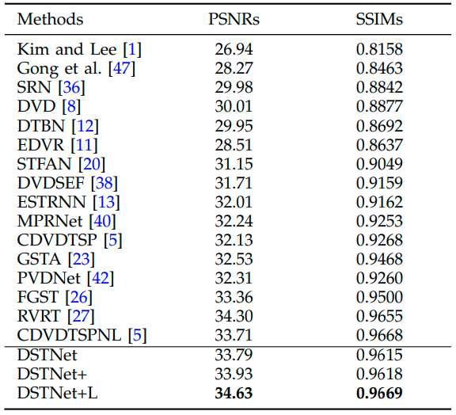

## 📖 Learning Efficient Deep Discriminative Spatial and Temporal Networks for Video Deblurring

[](https://huggingface.co/Meloo/DSTNetPlus)
[](https://github.com/sunny2109/DSTNet-plus/releases)
 

> [Jinshan Pan](https://jspan.github.io/), [Long Sun](https://github.com/sunny2109), [Boming Xu](https://github.com/xuboming8), [Jiangxin Dong](https://scholar.google.com/citations?user=ruebFVEAAAAJ&hl=zh-CN&oi=ao), and [Jinhui Tang](https://scholar.google.com/citations?user=ByBLlEwAAAAJ&hl=zh-CN)<br>
> [IMAG Lab](https://imag-njust.net/), Nanjing University of Science and Technology

---
This repo is a official implementation of "[Learning Efficient Deep Discriminative Spatial and Temporal Networks for Video Deblurring](https://github.com/sunny2109/DSTNet-plus/blob/main/figs/DstNetPlus_Manuscript.pdf)".

DSTNet+ is an extension of [DSTNet](https://github.com/xuboming8/DSTNet).


## 📜 News
- **2025.03.25**: All pretrained models and visual results are available.
- **2025.03.25**: The paper can be found [here](https://github.com/sunny2109/DSTNet-plus/blob/main/figs/DstNetPlus_Manuscript.pdf).
- **2025.03.14**: This paper is accepted by TPAMI.
- **2024.01.08**: This repo is created.

## 🚀 Quick Started
### 1. Environment Set Up
> - Python 3.9, PyTorch == 1.13
> - BasicSR 1.4.2
> - Platforms: Ubuntu 18.04, cuda-11

```bash
git clone https://github.com/sunny2109/DSTNet-plus.git
cd DSTNet-plus
conda create -n dstnetplus python=3.9
conda activate dstnetplus
# Install dependent packages
pip install -r requirements.txt
# Install cupy
# Please make sure that the installed Cupy version matches your existing CUDA installation!
pip install cupy-cuda11x
# Install BasicSR
python setup.py develop
```

### 2. Download datasets
Used training and testing sets can be downloaded as follows:

| Training Set     |  Pretrained model  | Visual Result  |
| :----------      | :-------------: | :--------------: |
| [GoPro](http://data.cv.snu.ac.kr:8008/webdav/dataset/GOPRO/GOPRO_Large.zip)                               | [Hugging Face](https://huggingface.co/Meloo/DSTNetPlus/tree/main) \| [Github](https://github.com/sunny2109/DSTNet-plus/releases/tag/v0.1.0) \| [Baidu Cloud](https://pan.baidu.com/s/19RyEG_LupAsfwpKYx-F9cA?pwd=DSTP) | [Hugging Face](https://huggingface.co/Meloo/DSTNetPlus/tree/main) or [Baidu Cloud](https://pan.baidu.com/s/15qSS5Hcsiu0y0-e3zsC3FQ?pwd=DSTP) |
| [DVD](http://www.cs.ubc.ca/labs/imager/tr/2017/DeepVideoDeblurring/DeepVideoDeblurring_Dataset.zip)       | [Hugging Face](https://huggingface.co/Meloo/DSTNetPlus/tree/main) \| [Github](https://github.com/sunny2109/DSTNet-plus/releases/tag/v0.1.0) \| [Baidu Cloud](https://pan.baidu.com/s/19RyEG_LupAsfwpKYx-F9cA?pwd=DSTP) | [Hugging Face](https://huggingface.co/Meloo/DSTNetPlus/tree/main) or [Baidu Cloud](https://pan.baidu.com/s/15qSS5Hcsiu0y0-e3zsC3FQ?pwd=DSTP) |
| [BSD](https://drive.google.com/file/d/1VJdyojIAriC5QZp2N_0umEqkIMk1_9HA/view?usp=sharing)                 | [Hugging Face](https://huggingface.co/Meloo/DSTNetPlus/tree/main) \| [Github](https://github.com/sunny2109/DSTNet-plus/releases/tag/v0.1.0) \| [Baidu Cloud](https://pan.baidu.com/s/19RyEG_LupAsfwpKYx-F9cA?pwd=DSTP) | [Hugging Face](https://huggingface.co/Meloo/DSTNetPlus/tree/main) or [Baidu Cloud](https://pan.baidu.com/s/15qSS5Hcsiu0y0-e3zsC3FQ?pwd=DSTP) |
| [DAVIS-2017](https://data.vision.ee.ethz.ch/csergi/share/davis/DAVIS-2017-Unsupervised-trainval-480p.zip) | [Hugging Face](https://huggingface.co/Meloo/DSTNetPlus/tree/main) \| [Github](https://github.com/sunny2109/DSTNet-plus/releases/tag/v0.1.0) \| [Baidu Cloud](https://pan.baidu.com/s/19RyEG_LupAsfwpKYx-F9cA?pwd=DSTP) | [Hugging Face](https://huggingface.co/Meloo/DSTNetPlus/tree/main) or [Baidu Cloud](https://pan.baidu.com/s/15qSS5Hcsiu0y0-e3zsC3FQ?pwd=DSTP) |


### 3. Run the training code
```
# train DSTNetPlus on GoPro dataset
CUDA_VISIBLE_DEVICES=0,1,2,3,4,5,6,7 \
python -m torch.distributed.launch --nproc_per_node=8 --master_port=4321 python basicsr/train.py -opt options/train/train_base_GoPro.yml --launcher pytorch

# train DSTNetPlus on DVD dataset
CUDA_VISIBLE_DEVICES=0,1,2,3,4,5,6,7 \
python -m torch.distributed.launch --nproc_per_node=8 --master_port=4321 python basicsr/train.py -opt options/train/train_base_DVD.yml --launcher pytorch

# train DSTNetPlus on BSD dataset
CUDA_VISIBLE_DEVICES=0,1,2,3,4,5,6,7 \
python -m torch.distributed.launch --nproc_per_node=8 --master_port=4321 python basicsr/train.py -opt options/train/train_base_BSD1ms.yml --launcher pytorch
```

### 4. Quick inference
- Download the pretrained models. 

Please download the pretrained and put it in `./checkpoints/`.

- Download the testing dataset. 

Please download the test dataset and put it in `./datasets/`.
- Run the following commands:
```
python basicsr/test.py -opt options/test/test_base_GoPro.yml
```
- The test results will be in './results'.


## 👀 Results
We achieve SOTA performance on a set of blurring datasets. Detailed results can be found in the paper. All visual results of DSTNetPlus can be downloaded [here](https://huggingface.co/Meloo/DSTNetPlus/tree/main/visual_results).

<details>
<summary>Click to expand</summary>

- **Model efficiency** (PSNR vs. Runtime vs. Params) 
<p align="center">
 
</p>

- **Quantitative evaluations** <br>
&emsp;&emsp;&emsp;&emsp;&emsp;&emsp;&emsp;&emsp;&emsp;Evaluation on **GoPro** dataset  &emsp;&emsp;&emsp;&emsp;&emsp;&emsp;&emsp;&emsp;&emsp;&emsp;&emsp;&emsp;&emsp; Evaluation on **DVD** dataset <br>
<p align="center">
 &emsp;&emsp;&emsp;&emsp;&emsp;&emsp;   &emsp;&emsp;
  &emsp;&emsp;&emsp;&emsp;&emsp;
</p>

  

- Quantitative evaluations on the BSD dataset
<p align="center">
  
</p>

- Quantitative evaluations on the Set8 dataset
<p align="center">
  
</p>


- Deblurred results on **GoPro** dataset
<p align="center">

</p>

- Deblurred results on **DVD** dataset
<p align="center">

</p>

- Deblurred results on **Real-world** blurry frames
<p align="center">

</p>
</details>

## 📧 Contact
If you have any questions, please feel free to reach us out at cs.longsun@gmail.com

## 📎 Citation 

If you find our work helpful for your research, please consider giving a star ⭐ and citation 📝 
```bibtex
@article{DSTNetPlus,
  title={Learning Efficient Deep Discriminative Spatial and Temporal Networks for Video Deblurring},
  author={Pan, Jinshan and Sun, Long and Xu Boming and Dong, Jiangxin and Tang, Jinhui},
  journal={TPAMI},
  year={2025}
}
