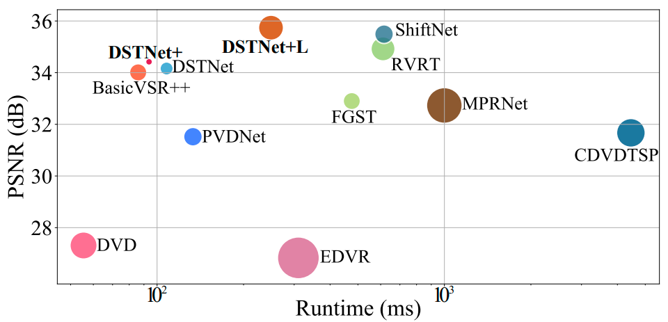
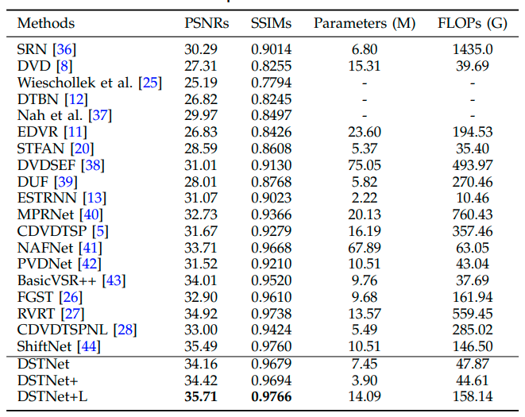

### 📖 DSTNet+
>  

  

<!-- > [Jinshan Pan](https://jspan.github.io/), [Long Sun](https://github.com/sunny2109), [Boming Xu](https://github.com/xuboming8), [Jinhui Tang](https://scholar.google.com/citations?user=ByBLlEwAAAAJ&hl=zh-CN), and [Jiangxin Dong](https://scholar.google.com/citations?user=ruebFVEAAAAJ&hl=zh-CN&oi=ao)
> [IMAG Lab](https://imag-njust.net/), Nanjing University of Science and Technology -->

---
This repo is a official implementation of "[Learning Efficient Deep Discriminative Spatial and Temporal Networks for Video Deblurring]()".

DSTNet+ is an extension of [DSTNet](https://github.com/xuboming8/DSTNet).

---
### Results
- **Model efficiency**
 

- **Quantitative evaluations**
    

- Deblurred results on **GoPro** dataset

- Deblurred results on **DVD** dataset

- Deblurred results on **Real-world** blurry images

